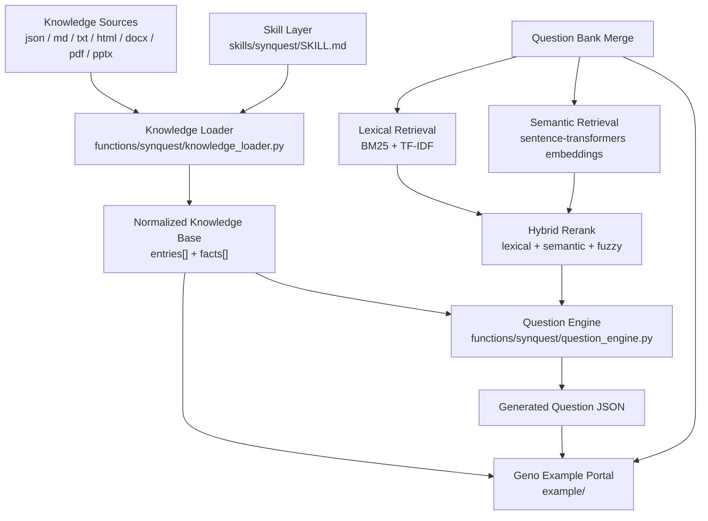
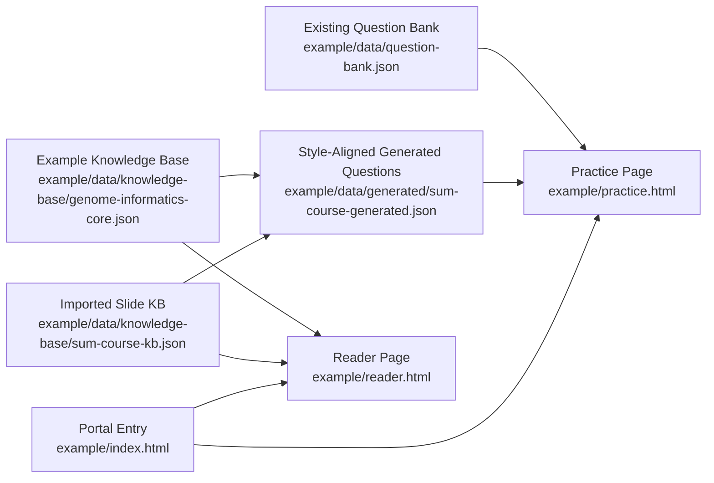

<p align="center">
  
</p>

<h1 align="center">SynQuest English Documentation</h1>

<p align="center">
  <a href="README.md"><strong>Back to Home</strong></a> ·
  <a href="README.zh.md"><strong>中文</strong></a> ·
  <a href="https://starry-49.github.io/SynQuest/"><strong>Live Demo</strong></a>
</p>

## Overview

SynQuest is a reusable skill and Python toolkit for turning domain knowledge sources into structured question banks. The repository also includes a Geno example portal that demonstrates knowledge browsing, practice, reading, and question generation on a concrete dataset.

## Quick Start

Open the live demo:

- Demo: [https://starry-49.github.io/SynQuest/](https://starry-49.github.io/SynQuest/)
- Repo: [https://github.com/Starry-49/SynQuest](https://github.com/Starry-49/SynQuest)

Preview locally:

```bash
python3 -m http.server 8000
```

Then open:

```text
http://localhost:8000/example/
```

Inspect a knowledge source:

```bash
python3 functions/synquest/cli.py inspect \
  --kb example/data/knowledge-base/genome-informatics-core.json
```

Extract a reusable knowledge-base JSON:

```bash
python3 functions/synquest/cli.py extract \
  --source sum.pdf \
  --out example/data/knowledge-base/sum-course-kb.json
```

Generate questions directly from the knowledge base:

```bash
python3 functions/synquest/cli.py synthesize \
  --kb example/data/knowledge-base/sum-course-kb.json \
  --count 24 \
  --out example/data/generated/synquest-batch.json
```

Generate questions that stay closer to an existing question bank:

```bash
python3 functions/synquest/cli.py synthesize \
  --kb example/data/knowledge-base/sum-course-kb.json \
  --style-bank example/data/question-bank.json \
  --semantic-model sentence-transformers/paraphrase-multilingual-MiniLM-L12-v2 \
  --style-top-k 5 \
  --count 24 \
  --out example/data/generated/sum-course-generated.json
```

Merge generated questions back into the bank:

```bash
python3 functions/synquest/cli.py merge \
  --bank example/data/question-bank.json \
  --incoming example/data/generated/sum-course-generated.json
```

## Core Capabilities

SynQuest is designed around three reusable capabilities:

- multi-format knowledge ingestion for `json`, `md`, `txt`, `html`, `docx`, `pdf`, and `pptx`
- normalized knowledge-base construction as `entries[] + facts[]`
- question generation that can either work directly from knowledge facts or align to an existing curated bank

Repository layers:

- `skills/` for Codex skill orchestration
- `functions/` for reusable Python logic and CLI tools
- `example/` for the Geno demo portal and demo datasets

## Architecture



### Architecture Units

| Unit | Meaning |
| --- | --- |
| `Knowledge Source` | raw source files, course material, documents, pages, or slide decks |
| `Entry` | one topic, section, page, or module |
| `Fact` | the smallest unit that can be turned into a question |
| `Knowledge Base` | normalized `entries[] + facts[]` data structure |
| `Existing Question Bank` | already curated questions |
| `Lexical Retrieval` | term-based retrieval over older questions |
| `Semantic Retrieval` | embedding-based retrieval over older questions |
| `Hybrid Rerank` | unified reranking across lexical, semantic, and fuzzy signals |
| `Generated Questions` | newly synthesized questions for preview or merge |

### Core Fields

| Field | Meaning |
| --- | --- |
| `id` | entry identifier |
| `module` | module or chapter |
| `title` | entry title |
| `summary` | entry summary |
| `keywords` | keywords |
| `facts` | fact list |
| `question` | candidate prompt |
| `answer` | correct answer |
| `explanation` | rationale |
| `distractors` | distractor options |
| `styleRefs` | retrieved old-question references |

## How It Works

### 1. Knowledge Extraction

SynQuest first normalizes different source formats into a common knowledge-base schema. The output can then be reused by the CLI, the example frontend, or downstream bank merge workflows.

### 2. Question Generation

SynQuest currently supports two generation modes:

- direct knowledge-based generation from extracted facts
- style-aligned generation using retrieval over an existing question bank

The current retrieval stack includes:

- `jieba` for Chinese tokenization
- `BM25` for lexical retrieval
- `TF-IDF + cosine similarity` for similarity scoring
- `sentence-transformers` for semantic retrieval
- hybrid reranking across lexical, semantic, and fuzzy signals
- `RapidFuzz` for prompt deduplication

The repository does not yet include the heavier semantic generation stack such as:

- cross-encoder rerankers
- LLM-based prompt rewriting

### 3. Bank Merge

Generated questions are emitted as bank-compatible JSON, so they can be previewed, exported, or merged back into a curated bank.

## Geno Example



In the current Geno example:

- example KB: [`example/data/knowledge-base/genome-informatics-core.json`](example/data/knowledge-base/genome-informatics-core.json)
- imported PDF KB: [`example/data/knowledge-base/sum-course-kb.json`](example/data/knowledge-base/sum-course-kb.json)
- existing bank: [`example/data/question-bank.json`](example/data/question-bank.json)
- style-aligned generated questions: [`example/data/generated/sum-course-generated.json`](example/data/generated/sum-course-generated.json)
- semantic-retrieval sample batch: [`example/data/generated/synquest-semantic-five.json`](example/data/generated/synquest-semantic-five.json)

The knowledge base represents what the system knows. The question bank represents what has already been curated. The generated batch represents what can be added next.
The current example bank already includes 5 `SynQuest` semantic-retrieval sample questions.

## Python API

Reusable logic lives in [`functions/synquest/`](functions/synquest/):

- [`functions/synquest/knowledge_loader.py`](functions/synquest/knowledge_loader.py)
- [`functions/synquest/question_engine.py`](functions/synquest/question_engine.py)
- [`functions/synquest/cli.py`](functions/synquest/cli.py)

Example usage:

```python
from functions.synquest import (
    build_knowledge_base,
    inspect_knowledge_source,
    load_knowledge_entries,
    load_question_bank,
    synthesize_questions,
)

report = inspect_knowledge_source("slides.pdf")
kb = build_knowledge_base("slides.pdf")
entries = load_knowledge_entries("slides.pdf")
style_bank = load_question_bank("example/data/question-bank.json")

generated = synthesize_questions(
    entries,
    count=12,
    seed=28,
    style_bank_questions=style_bank,
    style_top_k=5,
)
```

## Dependencies and Acknowledgements

SynQuest is primarily custom repository logic, with these reusable external components:

- `jieba`
- `rank-bm25`
- `scikit-learn`
- `sentence-transformers`
- `RapidFuzz`
- `Poppler` utilities

## Repository Structure

```text
.
├── skills/
├── functions/
├── example/
├── index.html
├── logo.png
├── LICENSE
├── README.md
├── README.zh.md
└── README.en.md
```

## License

This project uses the [MIT License](LICENSE).
