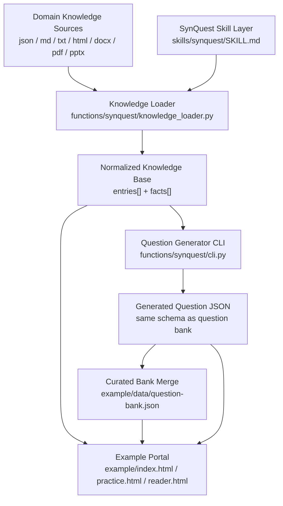
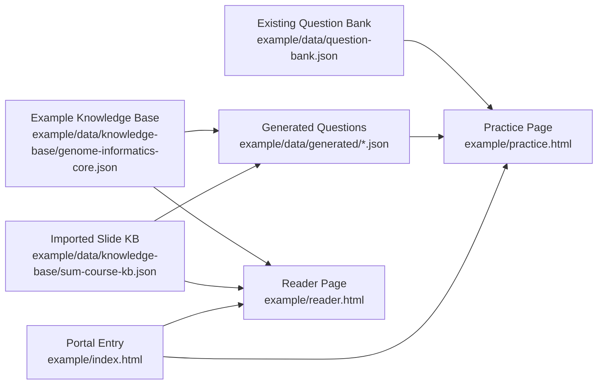
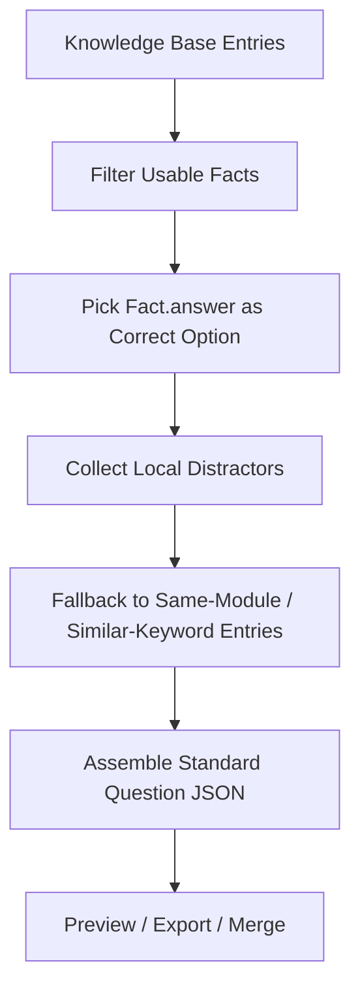

<p align="center">
  
</p>

<h1 align="center">SynQuest</h1>

<p align="center">
  一个可复用的 skill + Python functions 组合，用来把知识源转换成结构化题库。<br>
  仓库内同时附带一个 Geno 示例门户网站，用来展示题库浏览、在线答题、知识阅读与新题生成。
</p>

<p align="center">
  在线演示: <a href="https://starry-49.github.io/SynQuest/">https://starry-49.github.io/SynQuest/</a>
</p>

<p align="center">
  <a href="LICENSE">
    
  </a>
  <a href="https://starry-49.github.io/SynQuest/">
    
  </a>
  <a href="https://www.python.org/">
    
  </a>
  <a href="skills/synquest/SKILL.md">
    
  </a>
</p>

<p align="center">
  <a href="#快速开始"><strong>快速开始</strong></a> ·
  <a href="#synquest-总架构"><strong>SynQuest 总架构</strong></a> ·
  <a href="#geno-example-实例架构"><strong>Geno Example 实例架构</strong></a> ·
  <a href="#可复用-functions"><strong>可复用 Functions</strong></a> ·
  <a href="#geno-示例门户"><strong>Geno 示例门户</strong></a> ·
  <a href="#仓库结构"><strong>仓库结构</strong></a>
</p>

## 快速开始

### 1. 先打开在线 demo

- Live Demo: [https://starry-49.github.io/SynQuest/](https://starry-49.github.io/SynQuest/)
- Repo: [https://github.com/Starry-49/SynQuest](https://github.com/Starry-49/SynQuest)

### 2. 本地预览 Geno 门户

仓库已经带了示例题库和示例知识库，不需要先手动生成题目。

```bash
python3 -m http.server 8000
```

打开：

```text
http://localhost:8000/example/
```

### 3. 用 CLI 处理知识源

检查知识源：

```bash
python3 functions/synquest/cli.py inspect \
  --kb example/data/knowledge-base/genome-informatics-core.json
```

把原始知识源先抽成可提交的 SynQuest 知识库 JSON：

```bash
python3 functions/synquest/cli.py extract \
  --source sum.pdf \
  --out example/data/knowledge-base/sum-course-kb.json
```

生成新题：

```bash
python3 functions/synquest/cli.py synthesize \
  --kb example/data/knowledge-base/genome-informatics-core.json \
  --count 12 \
  --out example/data/generated/synquest-batch.json
```

把新题并回题库：

```bash
python3 functions/synquest/cli.py merge \
  --bank example/data/question-bank.json \
  --incoming example/data/generated/synquest-batch.json
```

### 4. 可选：重建 Geno 示例题库

只有当你想重新从旧版 HTML 素材提取示例题库时，才需要执行：

```bash
python3 functions/build_example_bank.py
```

## SynQuest 总架构



SynQuest 的核心不是某一门课，而是一条可复用的数据链路：

- 上游接各种知识源
- 中间把知识源统一规整成 `entries[].facts[]`
- 下游再把知识点转换成题目 JSON
- `example/` 只是把这条链路放到 Geno 门户里做展示

## 工作原理

### 1. 知识库层

SynQuest 先把知识源整理成统一结构：

- `entry`: 一个主题、章节、页面或知识模块
- `fact`: 这个 entry 下可被出题的事实单元

统一后的知识库对象大致长这样：

```json
{
  "meta": {},
  "entries": [
    {
      "id": "hgp-maps",
      "module": "基因组学基础",
      "title": "人类基因组计划与图谱",
      "summary": "描述 HGP、遗传图与物理图的核心概念。",
      "keywords": ["HGP", "遗传图", "物理图"],
      "facts": [
        {
          "question": "中国是在哪一年加入人类基因组计划的？",
          "answer": "1999年",
          "explanation": "中国于1999年加入 HGP。",
          "distractors": ["1990年", "2000年", "2001年"]
        }
      ]
    }
  ]
}
```

### 2. 题目生成层

当前 SynQuest 的出题机制是 deterministic 的可复用流程，不依赖把 prompt 写死在页面里：

1. 从知识库中筛出可用 `fact`
2. 把 `fact.answer` 当作正确答案
3. 优先使用 `fact.distractors` 作为干扰项
4. 如果本地干扰项不足，就从同模块 / 近关键词 entry 中补充候选
5. 组装成统一题目 JSON，供 CLI 或前端页面直接使用

也就是说：

- `knowledge_loader.py` 负责“把知识源变成知识库”
- `cli.py synthesize` 负责“把知识库变成题目”
- `merge` 负责“把生成题并回正式题库”

### 3. Example 层

Geno 门户并不承担知识抽取本身，它只负责：

- 读取现有题库
- 浏览和答题
- 读取知识模块
- 读取或展示新生成题

## Geno Example 实例架构



### 这个 example 里，知识库是什么

当前 Geno example 里有两类知识库来源：

- 结构化示例知识库：`example/data/knowledge-base/genome-informatics-core.json`
  这是一份已经整理好的标准 SynQuest 知识库，适合直接出题
- 从本地课件抽取出来的知识库：`example/data/knowledge-base/sum-course-kb.json`
  这是把 `sum.pdf` 处理成可提交 JSON 后得到的结果，原始 PDF 本体不直接进 repo

### 这个 example 里，现有题库是什么

现有题库是：

- `example/data/question-bank.json`

它的角色不是知识库，而是“已经整理好的题目集合”。它主要来自旧版 HTML 题库素材的结构化迁移，保留了：

- `prompt`
- `options`
- `answer`
- `analysis`
- `topic`
- `knowledgeRefs`

也就是说：

- `knowledge base` 回答“知道什么”
- `question bank` 回答“已经出了哪些题”

### 这个 example 里，新题是怎么生成的

Geno example 的新题生成机制目前是：



具体来说：

- 先从知识库 `entries[].facts[]` 里选出可出题事实
- 用 `answer` 作为正确答案
- 用该 fact 自带的 `distractors` 或相邻主题事实补齐选项
- 输出到 `example/data/generated/*.json`
- 如有需要，再合并回 `example/data/question-bank.json`

这套机制是 reusable 的，因为它依赖的是：

- 统一知识库 schema
- 通用抽取函数
- 通用题目 JSON schema

而不是依赖《基因组信息学》这一门课本身

## 自动算法

SynQuest 当前在知识库处理层已经用了可泛化的自动算法，而不是只盯着某一份课件写死规则：

- `JSON passthrough`: 已经结构化的知识库直接读取
- `Text section segmentation`: 对 `md/txt/html/docx` 按标题和段落分段
- `PDF raw-order extraction`: 用 `pdftotext -raw` 提取页面正文顺序
- `Layout-preserving title detection`: 用 `pdftotext -layout` 做标题候选检测
- `Repeated header/footer suppression`: 用跨页重复行频次自动去头尾
- `Duplicate slide fingerprint deduplication`: 用页面文本指纹去重
- `Keyword weighting`: 用关键词频次和位置权重生成 `keywords`
- `Fact segmentation`: 把页面/段落拆成可出题 `fact`
- `PPTX OOXML parsing`: 对 `pptx` 直接解析 slide XML、title placeholder 和 notes

如果后面继续增强，也最自然的是往这条通用链路上加：

- BM25 / lexical retrieval
- embedding 检索
- 多事实组装
- 基于旧题的改编策略

而不是继续往某一个 example 页面里塞特化逻辑

## 可复用 Functions

仓库里最核心的 Python 能力位于 [`functions/synquest/`](functions/synquest/)。

目前提供的可复用入口包括：

- [`functions/synquest/knowledge_loader.py`](functions/synquest/knowledge_loader.py): 统一读取知识源
- [`functions/synquest/cli.py`](functions/synquest/cli.py): inspect / extract / synthesize / merge
- [`functions/build_example_bank.py`](functions/build_example_bank.py): 从旧版 HTML 重建 Geno 示例题库

支持的知识源格式：

- `json`
- `md`
- `txt`
- `html`
- `docx`
- `pdf`
- `pptx`

如果你想在自己的脚本里直接复用：

```python
from functions.synquest import (
  SUPPORTED_SUFFIXES,
  build_knowledge_base,
  inspect_knowledge_source,
  load_knowledge_entries,
  read_knowledge_text,
)

report = inspect_knowledge_source("notes.docx")
entries = load_knowledge_entries("notes.docx")
payload = build_knowledge_base("slides.pdf")
```

## Geno 示例门户

门户页面位于 [`example/`](example/)。

它负责展示三类能力：

- 题库浏览与在线答题：[`example/practice.html`](example/practice.html)
- 知识阅读与题目映射：[`example/reader.html`](example/reader.html)
- 统一入口首页：[`example/index.html`](example/index.html)

示例数据也全部集中在 `example/` 内：

- 示例题库：[`example/data/question-bank.json`](example/data/question-bank.json)
- 示例知识库：[`example/data/knowledge-base/genome-informatics-core.json`](example/data/knowledge-base/genome-informatics-core.json)
- PDF 抽取知识库：[`example/data/knowledge-base/sum-course-kb.json`](example/data/knowledge-base/sum-course-kb.json)
- 新题样例：[`example/data/generated/sum-course-generated.json`](example/data/generated/sum-course-generated.json)
- 示例图片：[`example/images/`](example/images/)
- 历史旧页面：[`example/legacy/`](example/legacy/)
- 原始答案与截图：[`example/user_data/`](example/user_data/)

也就是说：

- `SynQuest` 负责 skill 和 functions
- `Geno` 负责 example 门户和示例数据

## 仓库结构

现在仓库主目录收成三层：

```text
.
├── skills/
│   └── synquest/
│       ├── agents/
│       ├── references/
│       └── SKILL.md
├── functions/
│   ├── build_example_bank.py
│   └── synquest/
│       ├── __init__.py
│       ├── cli.py
│       └── knowledge_loader.py
├── example/
│   ├── assets/
│   ├── data/
│   ├── images/
│   ├── legacy/
│   ├── user_data/
│   ├── index.html
│   ├── practice.html
│   └── reader.html
├── index.html
├── logo.png
├── LICENSE
└── README.md
```

目录职责：

- `skills/`: SynQuest 的 skill 定义与参考说明
- `functions/`: 可复用 Python functions 与 CLI
- `example/`: Geno 示例门户、示例题库、旧版素材与图像资源

## 相关入口

- Skill: [`skills/synquest/SKILL.md`](skills/synquest/SKILL.md)
- Formats: [`skills/synquest/references/knowledge_base_formats.md`](skills/synquest/references/knowledge_base_formats.md)
- Schema: [`skills/synquest/references/question_schema.md`](skills/synquest/references/question_schema.md)

## License

This project uses the [MIT License](LICENSE).
