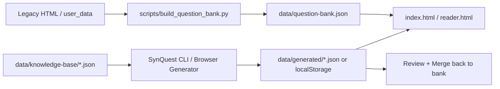

# SynQuest: 基于知识库的题目生成与基因组信息学题库系统

[](LICENSE)
[](#github-pages)
[](https://www.python.org/)
[](synquest/SKILL.md)

[**Quick Start**](#quick-start) · [**Project Structure**](#project-structure) · [**SynQuest Skill**](#synquest-skill) · [**GitHub Pages**](#github-pages)

README 的组织方式参考了 [HKUDS/DeepTutor](https://github.com/HKUDS/DeepTutor)，但这个仓库聚焦于一个更清晰的单域问题：把《基因组信息学》题目、课程知识库、题目生成逻辑与静态演示页面整理成一个可以持续扩展的项目。

## What This Repo Does

- 整理原本写在 HTML 中的 2022 / 2023 题目，并规范化为 `data/question-bank.json`
- 提供一个主 skill: [`SynQuest`](synquest/SKILL.md)，用于把知识库转换为题目
- 提供一个无后端的 GitHub Pages 页面：
  - 调度与浏览现有题库
  - 按指定数量抽题测试
  - 基于知识库合成新题并加入浏览器本地扩展题库
  - 导出生成题目，方便再合并回仓库
- 保留原始整理页面作为 `legacy/`，便于追溯与二次迁移

## Key Features

- **Structured Question Bank**: 182 道题从旧版 `index.html` 中提取为可复用 JSON，包含题型、主题、难度、答案、解析、图片与关联知识模块。
- **SynQuest Skill + CLI**: 同一套仓库内同时提供 skill 说明与命令行工具，便于 Codex/本地脚本复用。
- **Knowledge-Driven Generation**: `data/knowledge-base/` 中的课程知识库可直接驱动出题，不再依赖把题目硬编码进页面。
- **Static GitHub Pages Demo**: 页面只依赖静态文件，适合作为 GitHub Pages 示例站点。
- **Composable but Organized**: `SynQuest` 可以和其他 skill 联用形成放大效果，但仓库结构保持单一主入口、分层清晰。

## Project Structure

```text
.
├── assets/
│   ├── app.js                    # 主页状态管理、筛选、抽题、渲染
│   ├── reader.js                 # Study Reader 逻辑
│   ├── styles.css                # GitHub Pages 共用样式
│   └── synquest-browser.js       # 浏览器端 SynQuest 生成器
├── data/
│   ├── generated/                # CLI 或浏览器导出的新增题目样例
│   ├── knowledge-base/
│   │   └── genome-informatics-core.json
│   └── question-bank.json        # 标准化后的正式题库
├── images/                       # 原始题目图片
├── legacy/
│   ├── index.legacy.html         # 原始本地题库页面备份
│   └── reader.legacy.html        # 原始课件阅读页备份
├── scripts/
│   └── build_question_bank.py    # 从 legacy HTML 提取题库 JSON
├── synquest/
│   ├── agents/openai.yaml        # skill UI 元数据
│   ├── references/               # schema 与知识库格式说明
│   ├── scripts/synquest.py       # inspect / synthesize / merge CLI
│   └── SKILL.md                  # SynQuest 主 skill
├── user_data/
│   ├── answers.json              # 原始答案与人工笔记
│   └── images/                   # 原始辅助截图
├── index.html                    # GitHub Pages 首页
├── reader.html                   # Study Reader
├── logo.png
├── LICENSE
└── README.md
```

### Directory Roles

- `synquest/` 是主技能目录，负责“如何生成题目”。
- `scripts/` 是迁移和构建层，负责“如何把旧数据整理出来”。
- `data/` 是正式数据层，页面和 CLI 都读取这里。
- `assets/` 是展示层，页面逻辑与样式统一放在这里。
- `legacy/` 与 `user_data/` 是历史来源层，用于追溯、校验和二次整理。

## Architecture



## Quick Start

### 1. Generate the normalized question bank

```bash
python3 scripts/build_question_bank.py
```

### 2. Start a local static server

直接打开 `index.html` 会受到浏览器对 `fetch()` 的限制，建议使用本地服务器：

```bash
python3 -m http.server 8000
```

然后访问：

```text
http://localhost:8000
```

### 3. Open the GitHub Pages style demo

- 首页：`index.html`
- 学习阅读页：`reader.html`

## SynQuest Skill

主 skill 位于 [`synquest/SKILL.md`](synquest/SKILL.md)。它的设计重点不是把所有逻辑揉成一个大文件，而是保留一个主入口，然后把能力拆成几层：

- `SKILL.md`: 什么时候触发、怎么用
- `references/`: schema 与知识库格式
- `scripts/synquest.py`: 可执行 CLI
- `assets/synquest-browser.js`: 前端静态站点内的轻量生成器

### Why This Layering Works

- **单一主 skill** 保证入口清晰
- **多层实现** 允许它与别的 skill 联用，例如：
  - 先用别的 skill 构建知识库
  - 再用 `SynQuest` 生成题目
  - 最后交给前端或 GitHub 工作流发布

换句话说，skill 可以多重联用形成放大效果，但目录上仍然坚持“一个主 skill，多个明确子模块”。

### CLI Examples

Inspect a knowledge base:

```bash
python3 synquest/scripts/synquest.py inspect \
  --kb data/knowledge-base/genome-informatics-core.json
```

Generate new questions:

```bash
python3 synquest/scripts/synquest.py synthesize \
  --kb data/knowledge-base/genome-informatics-core.json \
  --count 12 \
  --out data/generated/synquest-batch.json
```

Merge generated questions into the main bank:

```bash
python3 synquest/scripts/synquest.py merge \
  --bank data/question-bank.json \
  --incoming data/generated/synquest-batch.json
```

## GitHub Pages

这个仓库的前端是纯静态页面，天然适合 GitHub Pages：

- `index.html` 提供题库浏览、筛选、抽题与本地生成
- `reader.html` 提供知识模块和题目详情联动阅读
- 浏览器生成的新题默认写入 `localStorage`
- 导出后可以再通过 CLI 审核并合并回正式题库

这意味着：

1. GitHub Pages 负责“展示和交互”
2. `SynQuest` CLI 负责“批量生成和正式入库”
3. 仓库本身负责“版本化与可追溯”

## Data Notes

- `data/question-bank.json` 是正式题库，适合提交到 Git
- `data/generated/` 是生成样例与中间产物
- `user_data/` 是历史人工答案与截图，不直接作为页面的核心数据源，但用于迁移和补充

## License

This project uses the [MIT License](LICENSE).

## Acknowledgement

- README 版式灵感参考 [DeepTutor](https://github.com/HKUDS/DeepTutor)
- 如果你希望把这个项目继续放大成更复杂的研究代理工作流，可以进一步接入其他 skill 或使用 [K-Dense Web](https://www.k-dense.ai)
