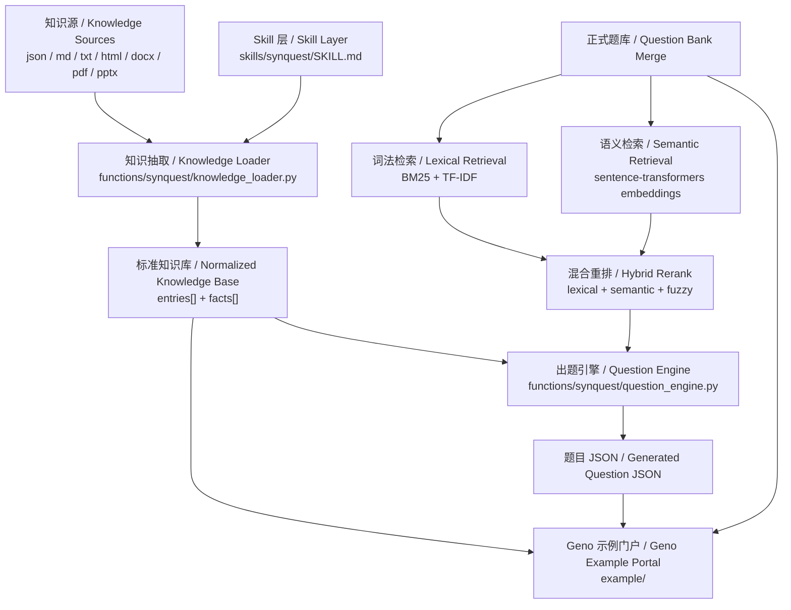
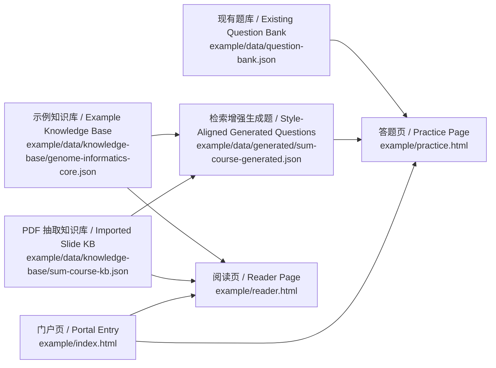

<p align="center">
  
</p>

<h1 align="center">SynQuest 中文文档</h1>

<p align="center">
  <a href="README.md"><strong>返回首页</strong></a> ·
  <a href="README.en.md"><strong>English</strong></a> ·
  <a href="https://starry-49.github.io/SynQuest/"><strong>Live Demo</strong></a>
</p>

## 快速开始

先体验在线示例：

- Demo: [https://starry-49.github.io/SynQuest/](https://starry-49.github.io/SynQuest/)
- Repo: [https://github.com/Starry-49/SynQuest](https://github.com/Starry-49/SynQuest)

本地预览 Geno 门户：

```bash
python3 -m http.server 8000
```

打开：

```text
http://localhost:8000/example/
```

用 CLI 检查知识源：

```bash
python3 functions/synquest/cli.py inspect \
  --kb example/data/knowledge-base/genome-informatics-core.json
```

把原始知识源抽取成标准知识库 JSON：

```bash
python3 functions/synquest/cli.py extract \
  --source sum.pdf \
  --out example/data/knowledge-base/sum-course-kb.json
```

基于知识库生成新题：

```bash
python3 functions/synquest/cli.py synthesize \
  --kb example/data/knowledge-base/sum-course-kb.json \
  --count 24 \
  --out example/data/generated/synquest-batch.json
```

如果希望新题更接近现有题库的风格与问法，可以加入旧题检索：

```bash
python3 functions/synquest/cli.py synthesize \
  --kb example/data/knowledge-base/sum-course-kb.json \
  --style-bank example/data/question-bank.json \
  --semantic-model sentence-transformers/paraphrase-multilingual-MiniLM-L12-v2 \
  --style-top-k 5 \
  --count 24 \
  --out example/data/generated/sum-course-generated.json
```

把生成题并回题库：

```bash
python3 functions/synquest/cli.py merge \
  --bank example/data/question-bank.json \
  --incoming example/data/generated/sum-course-generated.json
```

## 核心能力

SynQuest 面向三类使用场景：

- 多格式知识源接入：支持 `json`、`md`、`txt`、`html`、`docx`、`pdf`、`pptx`
- 标准知识库生成：统一规整为 `entries[] + facts[]`
- 新题生成与题库扩展：既可直接从知识库出题，也可参考现有题库风格生成同源新题

在这套仓库里：

- `skills/` 提供 Codex 可直接调用的 skill 定义
- `functions/` 提供可复用的 Python functions 与 CLI
- `example/` 提供 Geno 示例门户与示例数据

## 架构



### 架构单元与字段

| 中文 | English | 作用 |
| --- | --- | --- |
| 知识源 | Knowledge Source | 原始课程材料、文档、网页或课件 |
| 知识条目 | Entry | 一个主题、章节、页面或模块 |
| 事实单元 | Fact | 可被出题的最小知识片段 |
| 标准知识库 | Normalized Knowledge Base | 统一后的 `entries[] + facts[]` 数据层 |
| 现有题库 | Existing Question Bank | 已整理好的正式题目集合 |
| 词法检索 | Lexical Retrieval | 基于词项匹配召回相近旧题 |
| 语义检索 | Semantic Retrieval | 基于向量相似度召回相近旧题 |
| 混合重排 | Hybrid Rerank | 对词法与语义候选做统一重排 |
| 生成题 | Generated Questions | 新生成、待预览或待合并的新题 |

### 核心字段

| Field | 中文含义 | English Meaning |
| --- | --- | --- |
| `id` | 条目标识 | entry identifier |
| `module` | 所属模块 | module / chapter |
| `title` | 条目标题 | entry title |
| `summary` | 条目摘要 | entry summary |
| `keywords` | 关键词 | keywords |
| `facts` | 事实列表 | fact list |
| `question` | 候选题干 | question prompt |
| `answer` | 正确答案 | correct answer |
| `explanation` | 解析或依据 | explanation / rationale |
| `distractors` | 干扰项 | distractors |
| `styleRefs` | 参考旧题 | retrieved style exemplars |

## 工作原理

### 1. 知识抽取

SynQuest 先把不同格式的知识源统一抽成标准知识库。输出结构对前端、CLI 和后续合并流程一致，方便在不同项目里重复使用。

### 2. 新题生成

SynQuest 提供两种生成模式：

- 知识库直出：从 `facts` 中选择可出题事实，直接组装题目
- 风格对齐生成：在已有题库中检索最相近的旧题，再参考其题型、问法、难度和表达风格生成新题

当前已接入的检索与过滤组件：

- `jieba` 做中文分词
- `BM25` 做词法召回
- `TF-IDF + cosine similarity` 做文本相似度补充
- `sentence-transformers` 做语义向量检索
- hybrid rerank 融合词法、语义与字符相似度
- `RapidFuzz` 做题干近重复过滤

当前仓库里还没有接入更重的语义生成栈，例如：

- cross-encoder reranker
- LLM 改写题干

### 3. 题库合并

生成题输出为与题库兼容的 JSON。你可以直接：

- 在 Geno 门户里预览
- 导出为独立批次
- 再合并回正式题库

## Geno 示例



Geno 示例门户展示的是 SynQuest 在《基因组信息学》示例数据上的一个完整落地：

- 示例知识库：[`example/data/knowledge-base/genome-informatics-core.json`](example/data/knowledge-base/genome-informatics-core.json)
- PDF 抽取知识库：[`example/data/knowledge-base/sum-course-kb.json`](example/data/knowledge-base/sum-course-kb.json)
- 现有题库：[`example/data/question-bank.json`](example/data/question-bank.json)
- 检索增强生成题：[`example/data/generated/sum-course-generated.json`](example/data/generated/sum-course-generated.json)
- 语义检索生成示例：[`example/data/generated/synquest-semantic-five.json`](example/data/generated/synquest-semantic-five.json)

在这个 example 中：

- 知识库负责“系统知道什么”
- 现有题库负责“系统已经整理了哪些题”
- 生成题负责“系统可以扩展出哪些新题”
- 正式题库中已并入 5 道 `SynQuest` 语义检索示例题

## Python 接口

可复用能力位于 [`functions/synquest/`](functions/synquest/)：

- [`functions/synquest/knowledge_loader.py`](functions/synquest/knowledge_loader.py): 多格式知识源接入与标准化
- [`functions/synquest/question_engine.py`](functions/synquest/question_engine.py): 新题生成、旧题检索、风格对齐
- [`functions/synquest/cli.py`](functions/synquest/cli.py): inspect / extract / synthesize / merge

可以直接在自己的脚本里调用：

```python
from functions.synquest import (
    build_knowledge_base,
    inspect_knowledge_source,
    load_knowledge_entries,
    load_question_bank,
    synthesize_questions,
)

report = inspect_knowledge_source("slides.pdf")
kb = build_knowledge_base("slides.pdf")
entries = load_knowledge_entries("slides.pdf")
style_bank = load_question_bank("example/data/question-bank.json")

generated = synthesize_questions(
    entries,
    count=12,
    seed=28,
    style_bank_questions=style_bank,
    style_top_k=5,
)
```

## 依赖与致谢

SynQuest 的核心流程以自编脚本为主，同时复用了以下通用算法与工具：

- `jieba`: 中文分词
- `rank-bm25`: BM25 词法检索
- `scikit-learn`: TF-IDF 与 cosine similarity
- `sentence-transformers`: 语义向量检索
- `RapidFuzz`: 字符串相似度与近重复过滤
- `Poppler` 工具链：`pdftotext`、`pdfinfo`、`pdfimages`

## 仓库结构

```text
.
├── skills/
│   └── synquest/
│       ├── agents/
│       ├── references/
│       └── SKILL.md
├── functions/
│   ├── build_example_bank.py
│   └── synquest/
│       ├── __init__.py
│       ├── cli.py
│       ├── knowledge_loader.py
│       └── question_engine.py
├── example/
│   ├── assets/
│   ├── data/
│   ├── images/
│   ├── legacy/
│   ├── user_data/
│   ├── index.html
│   ├── practice.html
│   └── reader.html
├── index.html
├── logo.png
├── LICENSE
├── README.md
├── README.zh.md
└── README.en.md
```

## License

This project uses the [MIT License](LICENSE).
